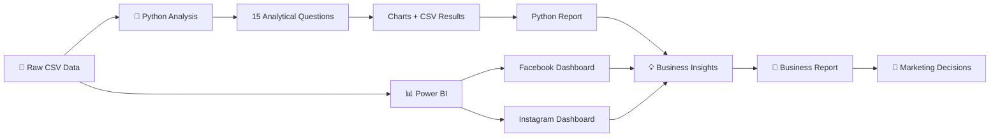

<div align="center">


# 📣 Digital Advertising Performance Analytics

### Meta paid-social performance analysis across Facebook & Instagram

**📊 Power BI · 🐍 Python · 📁 Multi-table Campaign Data · 🎯 Business Intelligence**

<br>

<a href="https://github.com/subachansubedi/Digital-Advertising-Performance-Analytics/blob/main/Dashboard/dashboard.pdf"><b>📊 Dashboard PDF</b></a>
&nbsp;•&nbsp;
<a href="https://github.com/subachansubedi/Digital-Advertising-Performance-Analytics/blob/main/Document/Meta_Ad_Analysis_Project_Report.pdf"><b>📄 Business Report</b></a>
&nbsp;•&nbsp;
<a href="https://github.com/subachansubedi/Digital-Advertising-Performance-Analytics/blob/main/python/digital_ad_python_analysis.py"><b>🐍 Python Analysis</b></a>
&nbsp;•&nbsp;
<a href="https://github.com/subachansubedi/Digital-Advertising-Performance-Analytics/blob/main/Meta_Ad_Performance_Dashboard.pbix"><b>📘 Power BI File</b></a>

<br><br>

<sub>Portfolio project by <b>Subachan Subedi</b></sub>

</div>

---

# 👀 Recruiter Quick Scan

> **Start here:** the two dashboard views below show the finished BI work first.  
> For the complete methodology, business interpretation, detailed findings, limitations, and recommendations, open the **[full Business Report](https://github.com/subachansubedi/Digital-Advertising-Performance-Analytics/blob/main/Document/Meta_Ad_Analysis_Project_Report.pdf)**.

<table>
<tr>
<td width="50%" valign="top">

### 📘 Facebook Dashboard


</td>
<td width="50%" valign="top">

### 📸 Instagram Dashboard


</td>
</tr>
</table>

<table>
<tr>
<td align="center" width="25%">

### 📊 Power BI
**Dashboard layer**

Facebook and Instagram performance presented for fast business review.

</td>
<td align="center" width="25%">

### 🐍 Python
**15-question analysis**

Programmatic analysis with exported charts and tabular results.

</td>
<td align="center" width="25%">

### 📁 4 CSVs
**Raw data**

Users, campaigns, ads, and ad-event data.

</td>
<td align="center" width="25%">

### 📄 2 Reports
**Business + Python**

A business-facing report and a dedicated Python analysis report.

</td>
</tr>
</table>

---

# 🎯 Project Objective

The project asks a practical paid-social question:

> ## How effectively are Facebook and Instagram campaigns moving users through the advertising journey, and where should performance be investigated across platform, funnel stage, creative format, audience, timing, geography, and campaign budget?

The analysis is structured around these areas:

| Area | What it evaluates |
|---|---|
| 📘 **Platform** | Facebook vs. Instagram performance |
| 🔄 **Funnel** | Movement and drop-off across advertising events |
| 🎨 **Ad Format** | Differences across creative/ad formats |
| 👥 **Audience** | Response patterns across user segments |
| ⏰ **Timing** | Performance differences by time |
| 🌍 **Country** | Geographic performance |
| 💸 **Campaign Budget** | Budget as a campaign-performance dimension |
| 📅 **Weekly Activity** | Changes in activity over time |

> This README gives the **portfolio overview**. For full business explanation and detailed conclusions, refer to the **[Meta Ad Analysis Project Report](https://github.com/subachansubedi/Digital-Advertising-Performance-Analytics/blob/main/Document/Meta_Ad_Analysis_Project_Report.pdf)**.

---

# 📊 Power BI Dashboard

**Power BI file:** [Meta_Ad_Performance_Dashboard.pbix](https://github.com/subachansubedi/Digital-Advertising-Performance-Analytics/blob/main/Meta_Ad_Performance_Dashboard.pbix)  
**PDF export:** [Dashboard/dashboard.pdf](https://github.com/subachansubedi/Digital-Advertising-Performance-Analytics/blob/main/Dashboard/dashboard.pdf)

## 📘 Facebook Performance

<p align="center">
  
</p>

The Facebook view gives a fast visual summary of paid-social performance and provides one side of the cross-platform comparison.

## 📸 Instagram Performance

<p align="center">
  
</p>

The Instagram view uses the same analytical context so platform differences can be reviewed consistently.

### Why this matters

The dashboard is intended to help a reviewer quickly understand:

- platform performance,
- event/funnel behavior,
- audience patterns,
- ad-format differences,
- campaign activity,
- and where deeper analysis is required.

For the full interpretation behind the dashboard, use the **[Business Report](https://github.com/subachansubedi/Digital-Advertising-Performance-Analytics/blob/main/Document/Meta_Ad_Analysis_Project_Report.pdf)**.

---

# 🐍 Python Analysis

**Main script:** [python/digital_ad_python_analysis.py](https://github.com/subachansubedi/Digital-Advertising-Performance-Analytics/blob/main/python/digital_ad_python_analysis.py)  
**Python report:** [digital_advertising_python_report.pdf](https://github.com/subachansubedi/Digital-Advertising-Performance-Analytics/blob/main/python/Python%20Report%20Pdf/digital_advertising_python_report.pdf)  
**15-question results:** [15_question_results.csv](https://github.com/subachansubedi/Digital-Advertising-Performance-Analytics/blob/main/python/outputs/15_question_results.csv)

The Python implementation provides the deeper analytical layer behind the project and exports both visual and tabular outputs.

## 🔬 Analytical Outputs

<table>
<tr>
<td width="50%" valign="top">

### 01 — Event Mix


</td>
<td width="50%" valign="top">

### 02 — Funnel


</td>
</tr>

<tr>
<td width="50%" valign="top">

### 03–05 — Platform Comparison


</td>
<td width="50%" valign="top">

### 06–08 — Ad Formats


</td>
</tr>

<tr>
<td width="50%" valign="top">

### 09–10 — Audience


</td>
<td width="50%" valign="top">

### 11–12 — Timing


</td>
</tr>

<tr>
<td width="50%" valign="top">

### 13 — Country Performance


</td>
<td width="50%" valign="top">

### 14 — Campaign Budget


</td>
</tr>
</table>

### 15 — Weekly Activity

<p align="center">
  
</p>

> For the full Python explanation, methodology, and interpretation, open the **[Python Analysis Report](https://github.com/subachansubedi/Digital-Advertising-Performance-Analytics/blob/main/python/Python%20Report%20Pdf/digital_advertising_python_report.pdf)**.

---

# 🗃️ Raw Data

The project uses four source files in **Raw Data File/**:

| File | Role in the analysis |
|---|---|
| `users.csv` | User-level information for audience analysis |
| `campaigns.csv` | Campaign context and budget information |
| `ads.csv` | Ad-level information for creative/format analysis |
| `ad_events.csv` | Event-level activity for funnel and behavioral analysis |

📂 [Browse the Raw Data File folder](https://github.com/subachansubedi/Digital-Advertising-Performance-Analytics/tree/main/Raw%20Data%20File)

A simplified conceptual relationship is:

```text
Campaigns
   │
   └── Ads
        │
        └── Ad Events
             │
             └── Users
```

This gives the project analytical coverage across **campaign, ad, event, user, platform, time, and geography**.

---

# ⚙️ Project Architecture



---

# 💼 What This Project Demonstrates

<table>
<tr>
<td width="33%" valign="top">

### 📊 BI & Visualization
- Power BI
- Dashboard design
- Facebook vs. Instagram comparison
- Executive visual storytelling

</td>
<td width="33%" valign="top">

### 🐍 Python Analytics
- Programmatic analysis
- 15 business questions
- Chart generation
- Funnel analysis
- Audience analysis
- Timing analysis
- Geographic analysis
- Budget analysis

</td>
<td width="33%" valign="top">

### 📄 Business Communication
- Full business report
- Dedicated Python report
- Exported results
- Recruiter-friendly project documentation

</td>
</tr>
</table>

---

# 🧭 Recommended Review Order

```text
1. README
   ↓
2. Facebook + Instagram dashboard screenshots
   ↓
3. Dashboard PDF
   ↓
4. Business Report
   ↓
5. Python output charts
   ↓
6. Python Report
   ↓
7. Python source code
   ↓
8. Raw data
```

### Direct links

- 📊 [Dashboard PDF](https://github.com/subachansubedi/Digital-Advertising-Performance-Analytics/blob/main/Dashboard/dashboard.pdf)
- 📘 [Power BI file](https://github.com/subachansubedi/Digital-Advertising-Performance-Analytics/blob/main/Meta_Ad_Performance_Dashboard.pbix)
- 📄 [Business Report](https://github.com/subachansubedi/Digital-Advertising-Performance-Analytics/blob/main/Document/Meta_Ad_Analysis_Project_Report.pdf)
- 🐍 [Python script](https://github.com/subachansubedi/Digital-Advertising-Performance-Analytics/blob/main/python/digital_ad_python_analysis.py)
- 📑 [Python Report](https://github.com/subachansubedi/Digital-Advertising-Performance-Analytics/blob/main/python/Python%20Report%20Pdf/digital_advertising_python_report.pdf)
- 📈 [15-question results CSV](https://github.com/subachansubedi/Digital-Advertising-Performance-Analytics/blob/main/python/outputs/15_question_results.csv)
- 📁 [Raw data folder](https://github.com/subachansubedi/Digital-Advertising-Performance-Analytics/tree/main/Raw%20Data%20File)
- 🐍 [Python folder](https://github.com/subachansubedi/Digital-Advertising-Performance-Analytics/tree/main/python)

---

# 📁 Repository Structure

```text
Digital-Advertising-Performance-Analytics/
├── README.md
├── LICENSE
├── Meta_Ad_Performance_Dashboard.pbix
│
├── Dashboard/
│   └── dashboard.pdf
│
├── Document/
│   └── Meta_Ad_Analysis_Project_Report.pdf
│
├── Raw Data File/
│   ├── ad_events.csv
│   ├── ads.csv
│   ├── campaigns.csv
│   └── users.csv
│
├── Screenshots/
│   ├── Facebook_dashboard.png
│   ├── Instagram_dashboard.png
│   ├── meta.png
│   └── meta_digital_advertising_banner.png
│
└── python/
    ├── .gitkeep
    ├── digital_ad_python_analysis.py
    │
    ├── Python Report Pdf/
    │   └── digital_advertising_python_report.pdf
    │
    └── outputs/
        ├── 15_question_results.csv
        ├── q01_event_mix.png
        ├── q02_funnel.png
        ├── q03_q05_platform_comparison.png
        ├── q06_q08_ad_formats.png
        ├── q09_q10_audience.png
        ├── q11_q12_timing.png
        ├── q13_country_performance.png
        ├── q14_campaign_budget.png
        └── q15_weekly_activity.png
```

---

# 📄 Reports

## Business Report

👉 [Meta_Ad_Analysis_Project_Report.pdf](https://github.com/subachansubedi/Digital-Advertising-Performance-Analytics/blob/main/Document/Meta_Ad_Analysis_Project_Report.pdf)

Use this for the **full project explanation**: business context, methodology, detailed dashboard interpretation, findings, limitations, and recommendations.

## Python Report

👉 [digital_advertising_python_report.pdf](https://github.com/subachansubedi/Digital-Advertising-Performance-Analytics/blob/main/python/Python%20Report%20Pdf/digital_advertising_python_report.pdf)

Use this for the **full Python analysis**, including deeper analytical questions and supporting outputs.

---

# ⚠️ Interpretation Notes

- Historical patterns do not guarantee future campaign outcomes.
- Platform differences should not automatically be treated as causal.
- Funnel metrics are most useful when interpreted together.
- Audience, timing, format, platform, and campaign context should be considered jointly.
- Large budget changes should ideally be validated with controlled testing.

---

# 🔮 Future Extensions

- Predictive campaign-performance modeling
- Funnel conversion forecasting
- A/B testing analysis
- Creative fatigue detection
- Advanced audience segmentation
- Budget optimization
- Automated campaign alerts
- Automated data pipelines
- Power BI Service deployment

---

<div align="center">

## 🔵 From Meta campaign activity to business decisions

### **Events → Funnel → Platform → Audience → Creative → Timing → Insight**

<br>

<a href="https://github.com/subachansubedi/Digital-Advertising-Performance-Analytics/blob/main/Dashboard/dashboard.pdf"><b>📊 Dashboard</b></a>
&nbsp;•&nbsp;
<a href="https://github.com/subachansubedi/Digital-Advertising-Performance-Analytics/blob/main/Document/Meta_Ad_Analysis_Project_Report.pdf"><b>📄 Business Report</b></a>
&nbsp;•&nbsp;
<a href="https://github.com/subachansubedi/Digital-Advertising-Performance-Analytics/blob/main/python/digital_ad_python_analysis.py"><b>🐍 Python Analysis</b></a>
&nbsp;•&nbsp;
<a href="https://github.com/subachansubedi/Digital-Advertising-Performance-Analytics/blob/main/python/Python%20Report%20Pdf/digital_advertising_python_report.pdf"><b>📑 Python Report</b></a>

<br><br>

**Project by: Subachan Subedi**

</div>

---

