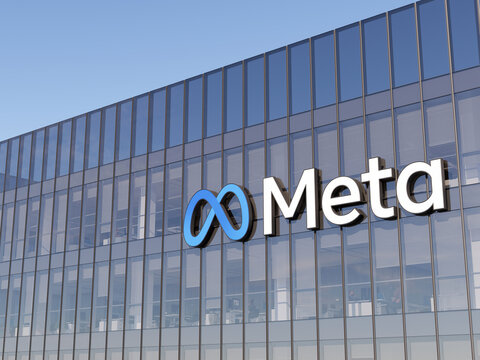

<p align="center">
  
</p>

<h1 align="center">Meta Ad Performance Dashboard</h1>
<p align="center">
  <b>A Power BI dashboard analyzing paid Facebook and Instagram advertising performance — reach, engagement, conversion, audience, format, geography, and time.</b>
</p>

<p align="center">
  
  
  
  
  
</p>

<p align="center">
  <a href="#the-problem">The Problem</a> •
  <a href="#dashboard">Dashboard</a> •
  <a href="#the-big-finding">Big Finding</a> •
  <a href="#key-insights">Insights</a> •
  <a href="#how-its-built">How It's Built</a> •
  <a href="#project-report">Full Report</a> •
  <a href="#explore-the-project">Explore</a>
</p>

---

## The Problem

Marketing teams can have plenty of advertising data without a clear view of **what's actually working**. This project answers one question:

> **Are these campaigns generating meaningful results — and where should the marketing team focus next?**

**Scope:** paid Facebook and Instagram activity only. Organic activity, Messenger, and Audience Network placements are excluded.

---

## Dashboard

Dedicated Facebook and Instagram views, built from the same underlying Power BI model, filtered independently.

<p align="center">
  
  
</p>

A dynamic metric selector switches every visual between **Impressions, Clicks, Engagements, and Purchases** — one page, four perspectives.

<p align="center"><b>339.8K Impressions · 40.1K Clicks · ~2.0K Purchases · 11.80% CTR</b></p>

---

## The Big Finding

> **The campaigns don't have an attention problem. They have a conversion problem.**

CTR sits around 11.8% and engagement rate around 13.6% across both platforms — strong ad-level interaction. But only ~5% of clicks result in a recorded purchase, and just 0.59% of impressions do. Facebook converts slightly better than Instagram; Instagram edges it on CTR. Video and Stories lead the format mix, though which one wins depends on the platform — Instagram's Image ads actually post the single highest CTR of any format on either platform.

That's the shape of the opportunity: less "get more clicks," more "fix what happens after the click."

*Full platform-by-platform breakdown, ad-format tables, audience and timing analysis, and the data model behind it all live in the Project Report below.*

---

## Key Insights

- **Facebook drives more volume; Instagram edges it on CTR** (11.86% vs. 11.76%) but converts slightly less efficiently (4.82% vs. 5.21% click-to-purchase).
- **Video and Stories are the strongest ad formats overall** — but Instagram's Video barely gets shown (3.3K impressions vs. Facebook's 15.1K) despite matching Facebook's conversion rate, a clear scaling opportunity.
- **Engagement skews young and female** on Facebook specifically — concentrated in the 18–30 range.
- **3 PM–8 PM is the strongest activity window** for scheduling paid delivery on both platforms.
- **India, Brazil, the US, Germany, and the UK** are the top-engaging countries — though not for the same reasons; volume vs. intent differs by region.
- **Weekly engagement holds steady** with no fatigue, but a few specific dates spike well above baseline, consistent with promotional activity.

---

## How It's Built

A dimensional Power BI model with one event-level fact table (`ad_events`) and four supporting dimensions — `ads`, `campaigns`, `users`, and a standalone `Calendar date` table for reliable time intelligence. It's technically closer to **star with one snowflaked branch** than a pure star schema: `campaigns` reaches the fact table indirectly, through `ads`, rather than connecting to it directly.

- **Power Query** for data prep, transformation, and structuring source tables
- **DAX** measures behind every KPI — CTR, Engagement Rate, Conversion Rate, Purchase Rate, budget metrics
- **Field Parameters** driving the dynamic metric selector across every visual
- **Two platform-specific report pages** sharing one underlying model, rather than duplicated logic

*The full data model diagram, table-by-table field reference, and KPI formula sheet are in the Project Report.*

---

## Project Report

The full analysis is consolidated into one report:

- **Part One** — Business Requirements
- **Part Two** — Data Architecture
- **Part Three** — Findings & Insights
- **Part Four** — Recommendations

**[📄 Read the full Project Report](Documents/Meta_Ad_Analysis_Project_Report.pdf)**

Includes detailed methodology, the data model, KPI definitions, platform-vs-platform findings, assumptions, limitations, and recommendations.

---

## Project Files

```
Meta-Ad-Performance-Dashboard/
│
├── Dashboard pdf/
│   └── dashboard.pdf
│
├── Meta_Ad_Performance_Dashboard.pbix
│
├── raw Data files/
│   ├── ad_events.csv
│   ├── ads.csv
│   ├── campaigns.csv
│   └── users.csv
│
├── documents/
│   └── Meta_Ad_Analysis_Project_Report.pdf
│
├── Screenshots/
│   ├── meta.png
│   ├── Facebook_Dashboard.png
│   └── Instagram_Dashboard.png
│
└── README.md
```

---

## Explore the Project

**View the dashboard** — [Dashboard PDF](Dashboard%20pdf/dashboard.pdf) 

**Open the interactive report** — [Meta Ad Performance Dashboard.pbix](Meta_Ad_Performance_Dashboard.pbix)

---

<p align="center">
  <sub>Portfolio project in marketing analytics and business intelligence, using a dataset modeled after common paid social advertising structures — not proprietary Meta Ads account data.</sub>
</p>
