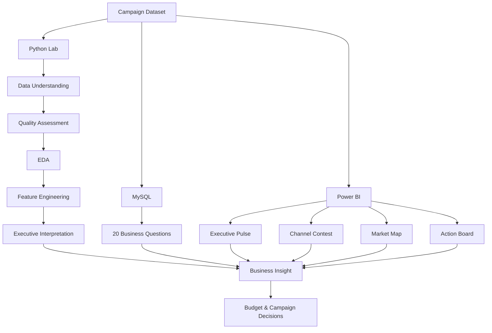

<div align="center">


# Digital Advertising Performance Analytics

### Campaign performance, profitability, and budget intelligence

**Python · MySQL · Power BI · Marketing Analytics**

<br>

<a href="#python-lab"><b>🐍 Python Analysis</b></a>
&nbsp;&nbsp;•&nbsp;&nbsp;
<a href="#sql-layer"><b>🗄️ SQL Analysis</b></a>
&nbsp;&nbsp;•&nbsp;&nbsp;
<a href="#decision-room"><b>📊 Power BI Dashboard</b></a>

<br><br>

<sub>Portfolio project by <b>Subachan Subedi</b></sub>

</div>

---

<p align="center">
  
</p>

<table>
<tr>
<td align="center" width="25%">

### 🐍 5
**Python Notebooks**

Structured analysis from data understanding to executive recommendations.

</td>
<td align="center" width="25%">

### 🗄️ 20
**SQL Questions**

Reusable business analysis across campaign performance and profitability.

</td>
<td align="center" width="25%">

### 📊 4
**Power BI Pages**

Executive reporting for performance, markets, and recommendations.

</td>
<td align="center" width="25%">

### 🎯 10+
**Marketing KPIs**

ROAS, profit, CPA, CTR, conversion rate, CPM, and more.

</td>
</tr>
</table>

> ### 💡 Project in one sentence
> **A complete digital advertising analytics workflow that turns raw campaign data into performance insights, profitability metrics, and budget decisions using Python, SQL, and Power BI.**

---

## 🧭 Explore the Project

<table>
<tr>
<td width="33%" valign="top">

### 🐍 Python Lab

**Understand → Validate → Explore → Engineer → Recommend**

[`Open Python workflow`](#python-lab)

</td>
<td width="33%" valign="top">

### 🗄️ SQL Layer

**20 repeatable business questions**

[`Open SQL analysis`](#sql-layer)

</td>
<td width="33%" valign="top">

### 📊 Decision Room

**4-page executive Power BI experience**

[`Open dashboard section`](#decision-room)

</td>
</tr>
</table>

---

## What This Project Actually Does

This repository is not only a dashboard.

It builds a complete analytical chain around digital advertising performance:

```text
RAW CAMPAIGN DATA
       │
       ├───────────────┬────────────────┐
       ▼               ▼                ▼
   PYTHON LAB       MYSQL LAYER     POWER BI LAYER
       │               │                │
 Understand data    Ask repeatable    Monitor campaign
 Check quality      business          performance
 Explore patterns   questions         visually
 Engineer KPIs      Rank outcomes     support decisions
       │               │                │
       └───────────────┴────────────────┘
                       ▼
               BUSINESS INSIGHT
                       ▼
               BUDGET DECISIONS
```

The project is designed around one central problem:

> **How can advertising data be translated into better decisions about platform mix, campaign strategy, market focus, and budget allocation?**

---

## Performance Lens

The analysis is organized around three levels of marketing performance:

<table>
<tr>
<td width="33%" valign="top">

### 👁️ Attention

- **Impressions** — campaign exposure
- **Clicks** — generated traffic
- **CTR** — impression-to-click efficiency
- **CPM** — cost of reach at scale

</td>
<td width="33%" valign="top">

### ✅ Conversion

- **Conversions** — completed desired actions
- **Conversion Rate** — click-to-conversion efficiency
- **CPC** — cost per click
- **CPA** — cost per conversion

</td>
<td width="33%" valign="top">

### 💰 Business Value

- **Revenue** — commercial output
- **Profit** — revenue less ad spend
- **ROAS** — revenue per ad dollar
- **Profit Margin** — profitability efficiency

</td>
</tr>
</table>

> The project deliberately moves beyond vanity metrics: **attention matters, but business value determines whether a campaign is economically effective.**

---

## 📌 The Analytical Story

```text
CAMPAIGN ACTIVITY
Impressions → Clicks → Conversions
                         │
                         ▼
                  COMMERCIAL VALUE
               Revenue → Profit → ROAS
                         │
                         ▼
                  MANAGEMENT ACTION
          Scale · Optimize · Investigate
```

This structure keeps the project focused on the business question behind the metrics: **which campaign activity is creating value, and where should the next advertising dollar be evaluated?**

---

<a id="python-lab"></a>

# 🐍 Python Lab

The Python implementation is organized as a **progressive analytical workflow**, not one large notebook.

<div align="center">

### 01 Understand → 02 Validate → 03 Explore → 04 Engineer → 05 Recommend

</div>

---

### `01_data_understanding.ipynb`

**Purpose:** Establish the shape, structure, and analytical meaning of the dataset before analysis begins.

**Core functionality**

- Dataset dimensions
- Column review
- Data-type inspection
- Initial sample exploration
- Descriptive statistics
- Variable classification
- Early observations

📓 [`Open notebook`](notebooks/01_data_understanding.ipynb)

---

### `02_data_quality_assessment.ipynb`

**Purpose:** Determine whether the campaign data is reliable enough for downstream analysis.

**Core functionality**

- Missing-value analysis
- Duplicate detection
- Data-type validation
- Range and reasonableness checks
- Consistency review
- Overall quality assessment

📓 [`Open notebook`](notebooks/02_data_quality_assessment.ipynb)

---

### `03_exploratory_data_analysis.ipynb`

**Purpose:** Find the strongest patterns across advertising performance.

**Analysis areas**

<table>
<tr>
<td width="33%">

**Platform**
- Revenue
- Profit
- ROAS
- Clicks
- Conversions

</td>
<td width="33%">

**Market**
- Country
- Industry
- Campaign type
- Segment performance

</td>
<td width="33%">

**Behavior**
- Time trends
- Engagement
- Conversion efficiency
- Spend efficiency

</td>
</tr>
</table>

📓 [`Open notebook`](notebooks/03_exploratory_data_analysis.ipynb)

---

### `04_feature_engineering.ipynb`

**Purpose:** Convert raw campaign measures into stronger business KPIs.

Key engineered fields include:

```text
Profit            = Revenue - Ad Spend
Profit Margin     = Profit / Revenue
Conversion Rate   = Conversions / Clicks
CPM               = (Ad Spend / Impressions) × 1,000
```

Additional derived fields prepare the campaign data for deeper profitability and efficiency analysis.

📓 [`Open notebook`](notebooks/04_feature_engineering.ipynb)

---

### `05_executive_summary_and_business_recommendations.ipynb`

**Purpose:** Translate the technical analysis into management language.

The final Python stage focuses on:

- High-performing advertising platforms
- Strong campaign types
- High-value markets
- Industry performance
- Profitability opportunities
- Budget-allocation opportunities
- Strategic optimization recommendations

📓 [`Open notebook`](notebooks/05_executive_summary_and_business_recommendations.ipynb)

---

## Python Capability Map

| Capability | Implemented through |
|---|---|
| Data profiling | Pandas / notebook inspection |
| Data-quality review | Null, duplicate, type, and consistency checks |
| Exploratory analysis | Aggregation, comparison, and visualization |
| KPI engineering | Derived financial and conversion metrics |
| Trend analysis | Time-based campaign performance exploration |
| Segment analysis | Platform, campaign, industry, and country views |
| Executive interpretation | Business-focused summary notebook |
| Reproducibility | Sequential Jupyter notebook workflow |

---

<a id="sql-layer"></a>

# 🗄️ The SQL Layer

### 20 questions. One reusable business-analysis layer.

📄 [`sql/marketing_campaign_business_questions.sql`](sql/marketing_campaign_business_questions.sql)

The SQL implementation complements Python by turning business questions into repeatable queries.

Rather than using SQL only to pull data, the project uses it to investigate performance across:

`Revenue` · `Profit` · `Platforms` · `Campaigns` · `Countries` · `Industries` · `Rankings` · `Efficiency`

### What the SQL work demonstrates

- Aggregation
- `GROUP BY`
- `ORDER BY`
- Filtering
- Ranking
- KPI calculations
- Cross-segment comparisons
- Business-question framing

> **Python discovers patterns. SQL makes business questions repeatable. Power BI makes the results consumable.**

---

<a id="decision-room"></a>

# 📊 Decision Room

The Power BI report is presented here as a **decision room** rather than a simple dashboard gallery.

Its four pages answer four different management questions.

---

## 01 / Executive Pulse

> **What is happening across the advertising portfolio right now?**

<p align="center">
  
</p>

**Primary signals**

`Revenue` · `Profit` · `ROAS` · `Clicks` · `Conversions` · `Trend`

---

## 02 / Channel Contest

> **Which advertising platform is generating stronger commercial performance?**

<p align="center">
  
</p>

The page compares platforms across:

- Revenue
- Profit
- ROAS
- Click volume
- Conversion volume
- Efficiency

---

## 03 / Market Map

> **Where is performance strongest by campaign type, industry, and geography?**

<p align="center">
  
</p>

The analysis shifts from channel-level performance to:

- Campaign type
- Industry
- Country
- Profitability
- ROAS
- Market opportunity

---

## 04 / Action Board

> **What should decision-makers investigate or prioritize next?**

<p align="center">
  
</p>

The recommendation layer brings together:

- Budget allocation
- Platform prioritization
- Campaign strategy
- Market opportunity
- ROAS optimization
- Profitability improvement

---

## Dashboard Contact Sheet

<table>
<tr>
<td width="50%"></td>
<td width="50%"></td>
</tr>
<tr>
<td align="center"><b>01 — Executive Pulse</b></td>
<td align="center"><b>02 — Channel Contest</b></td>
</tr>
<tr>
<td width="50%"></td>
<td width="50%"></td>
</tr>
<tr>
<td align="center"><b>03 — Market Map</b></td>
<td align="center"><b>04 — Action Board</b></td>
</tr>
</table>

---

# 🧠 From Metric to Decision

A useful way to read the project is as a sequence of management signals.

### High ROAS + High Profit
**Interpretation:** strong commercial efficiency  
**Decision use:** candidate for controlled budget expansion

### High Revenue + Weak Margin
**Interpretation:** volume is not translating into equally strong profitability  
**Decision use:** investigate spend, CPA, and campaign cost structure

### High CTR + Weak Conversion Rate
**Interpretation:** ads are generating interest but downstream performance is weaker  
**Decision use:** review audience quality, offer, landing experience, or campaign objective

### High Spend + Weak ROAS
**Interpretation:** budget concentration is not producing proportionate revenue  
**Decision use:** investigate before scaling further

### Low Spend + Strong Efficiency
**Interpretation:** potentially underfunded high-performing activity  
**Decision use:** test incremental budget rather than immediately making a large shift

### Strong Market / Industry Performance
**Interpretation:** some segments create more value than others  
**Decision use:** evaluate targeted investment opportunities

---

# 🧪 Analytical Architecture



---

# 🛠️ Technology Stack

<table>
<tr>
<td align="center" width="16%"><b>🐍<br>Python</b></td>
<td align="center" width="16%"><b>🐼<br>Pandas</b></td>
<td align="center" width="16%"><b>🔢<br>NumPy</b></td>
<td align="center" width="16%"><b>📓<br>Jupyter</b></td>
<td align="center" width="16%"><b>🗄️<br>MySQL</b></td>
<td align="center" width="16%"><b>📊<br>Power BI</b></td>
</tr>
</table>

| Layer | Tool | Role |
|---|---|---|
| Programming | Python | Main programmatic analysis layer |
| Data manipulation | Pandas | Cleaning, aggregation, segmentation, KPI analysis |
| Numerical analysis | NumPy | Numerical operations |
| Exploration | Jupyter Notebook | Reproducible staged analytics |
| Visualization | Matplotlib | Exploratory charts |
| Query analysis | MySQL | 20 repeatable business questions |
| BI / storytelling | Power BI | Executive monitoring and decision support |
| Version control | GitHub | Project documentation and delivery |

---

# 🚀 Run the Project

### 1. Clone

```bash
git clone https://github.com/subachansubedi/Digital-Advertising-Performance-Analytics.git
cd Digital-Advertising-Performance-Analytics
```

### 2. Create an environment

**Windows**

```bash
python -m venv .venv
.venv\Scripts\activate
```

**macOS / Linux**

```bash
python3 -m venv .venv
source .venv/bin/activate
```

### 3. Install dependencies

```bash
pip install -r requirements.txt
```

### 4. Start Jupyter

```bash
jupyter notebook
```

Recommended notebook order:

```text
01_data_understanding.ipynb
        ↓
02_data_quality_assessment.ipynb
        ↓
03_exploratory_data_analysis.ipynb
        ↓
04_feature_engineering.ipynb
        ↓
05_executive_summary_and_business_recommendations.ipynb
```

### 5. Run SQL

Execute:

```text
sql/marketing_campaign_business_questions.sql
```

in MySQL after loading the campaign dataset.

### 6. Open Power BI

Open:

```text
dashboard/Global_Digital_Advertising_Performance_Analysis.pbix
```

with Power BI Desktop.

---

# 🗂️ Repository Map

```text
Digital-Advertising-Performance-Analytics/
│
├── data/
│   └── global_ads_performance_dataset.csv
│
├── notebooks/
│   ├── 01_data_understanding.ipynb
│   ├── 02_data_quality_assessment.ipynb
│   ├── 03_exploratory_data_analysis.ipynb
│   ├── 04_feature_engineering.ipynb
│   └── 05_executive_summary_and_business_recommendations.ipynb
│
├── sql/
│   └── marketing_campaign_business_questions.sql
│
├── dashboard/
│   └── Global_Digital_Advertising_Performance_Analysis.pbix
│
├── images/
│   ├── executive_overview.png
│   ├── platform_performance.png
│   ├── market_campaign_analysis.png
│   └── executive_recommendations.png
│
├── requirements.txt
├── LICENSE
└── README.md
```

### Where to start

| If you want to... | Open |
|---|---|
| Understand the raw data | [`01_data_understanding.ipynb`](notebooks/01_data_understanding.ipynb) |
| Check data quality | [`02_data_quality_assessment.ipynb`](notebooks/02_data_quality_assessment.ipynb) |
| Explore campaign patterns | [`03_exploratory_data_analysis.ipynb`](notebooks/03_exploratory_data_analysis.ipynb) |
| See engineered KPIs | [`04_feature_engineering.ipynb`](notebooks/04_feature_engineering.ipynb) |
| Read the executive analysis | [`05_executive_summary_and_business_recommendations.ipynb`](notebooks/05_executive_summary_and_business_recommendations.ipynb) |
| Review SQL analysis | [`marketing_campaign_business_questions.sql`](sql/marketing_campaign_business_questions.sql) |
| Explore the Power BI model | [`Global_Digital_Advertising_Performance_Analysis.pbix`](dashboard/Global_Digital_Advertising_Performance_Analysis.pbix) |

---

# 🧰 Skills Demonstrated

`Python Analytics`  
`Pandas`  
`NumPy`  
`Jupyter Notebook`  
`Exploratory Data Analysis`  
`Data Quality Assessment`  
`Feature Engineering`  
`Marketing KPI Design`  
`MySQL`  
`Business Question Analysis`  
`Power BI`  
`Campaign Analytics`  
`ROAS Analysis`  
`Profitability Analysis`  
`Budget Optimization`  
`Executive Reporting`  
`Data Storytelling`

---

# ⚠️ Interpretation Notes

> [!IMPORTANT]
> Performance observed in the dataset should be treated as historical analytical evidence, not as a guarantee of future campaign results.

Important considerations:

- Historical ROAS is not a forecast.
- Correlation does not establish causal impact.
- Platform results can vary with creative, bidding strategy, objective, audience, seasonality, and attribution logic.
- Profitability depends on how revenue and advertising cost are defined in the source data.
- Budget reallocations should ideally be validated through controlled experimentation.

---

# 🔮 Next-Level Extensions

This project can be extended into a more advanced marketing analytics system through:

- Predictive campaign-performance modeling
- Time-series revenue / ROAS forecasting
- Automated budget optimization
- Audience segmentation
- A/B testing analysis
- Campaign anomaly alerts
- Automated platform ingestion
- Recommendation systems
- Power BI drill-through analysis
- Cloud deployment

---

<div align="center">

## The idea behind the project

### Don’t stop at **“Which ad performed best?”**

### Ask:

## **“Where should the next advertising dollar go — and why?”**

<br>

### 🐍 [Start with Python](notebooks/01_data_understanding.ipynb)
### 🗄️ [Explore the SQL analysis](sql/marketing_campaign_business_questions.sql)
### 📊 [Open the Power BI file](dashboard/Global_Digital_Advertising_Performance_Analysis.pbix)

<br>

**Subachan Subedi**

<br>

<a href="#digital-advertising-performance-analytics">↑ Back to top</a>

</div>

---

## License

See [`LICENSE`](LICENSE) for the repository license.
